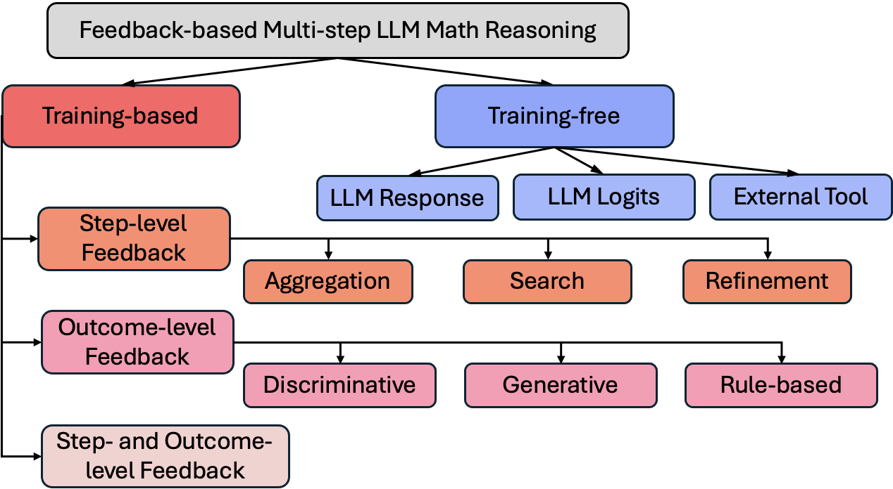
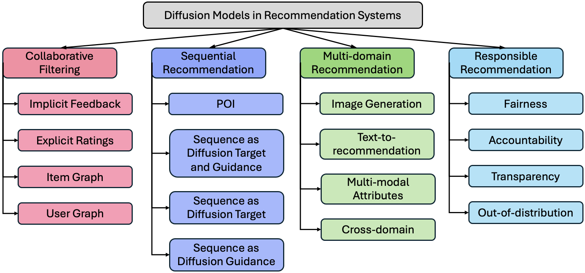
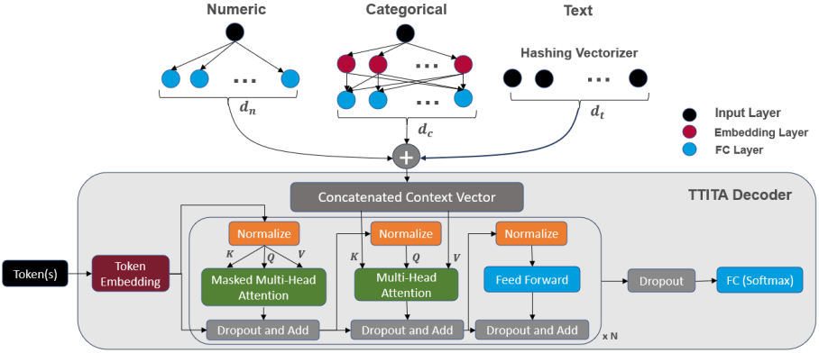
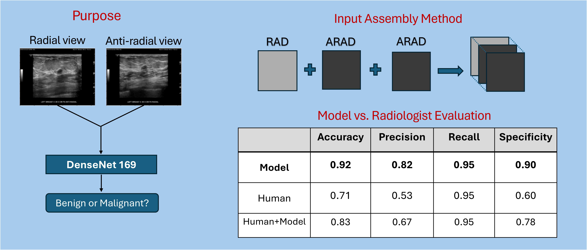




  
More information can be found on <a href="{{site.author.googlescholar}}">Google Scholar</a>.



---

## **Survey: Multi-step LLM Math Reasoning**
[[Arxiv]](https://arxiv.org/pdf/2502.14333) [[GitHub]](https://github.com/tingruew/Feedback-based-Multi-step-LLM-Math-Reasoning)

  
  
With chain-of-thought enhancing the LLM performance through multi-step reasoning, models try to integrate this multi-step process within itself. We study how stepwise feedback facilitates this in existing papers with a focus on mathematics due to its logical nature and the large volume of research in the field. We propose a taxonomy based on the existence of training and the structure of feedback.

## **Survey: Diffusion Models in Recommendation Systems**
[[Arxiv]](https://arxiv.org/pdf/2501.10548) [[GitHub]](https://github.com/tingruew/DiffusionModels-In-RecSys)

  
  
As diffusion models demonstrate exceptional ability at handling complex data distributions, we examine its application in recommendation systems to model user-item interactions and comprehensively survey existing papers in this domain. We propose a taxonomy to categorize based on the type of recommendation task and the specific objective. 

## **Table Transformers for Imputing Textual Attributes**
[[Pattern Recognition Letters]](https://arxiv.org/pdf/2408.02128) [[GitHub]](https://github.com/tingruew/TTITA-Text-Imputation)

  
  
Data science leverages models to understand the data, and the quality of machine learning model predictions often depends on the completeness of training data. As previous work focus on numeric and categorical attributes, we develope a novel pipeline to fill in missing data for textual attributes with encoder and transformer models.

## **Breast Cancer Detection on Dual-View Sonography via Data-Centric Deep Learning**
[[IEEE OJEMB]](https://ieeexplore.ieee.org/abstract/document/10666269)

  
  
By training a deep learning model based on DenseNet, we achieve high performance in classifying benign and malignant breast masses under radial and anti-radial views, outperforming a radiologist by a large margin. Additionally, we find better performance from the radiologist when the model's predictions are incorporated into the human decision process.

