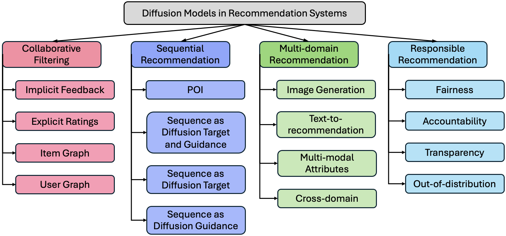




  
You can also find my articles on <a href="{{site.author.googlescholar}}">MMMMy Google Scholar profile</a>.



---

## Project 1: **Diffusion Models in Recommendation Systems: A Survey**

**Description:**  
This project is focused on [briefly describe the core function or objective of the project]. I built this project using [technologies/tools used]. It serves to [mention the purpose or what problem it solves].

---

